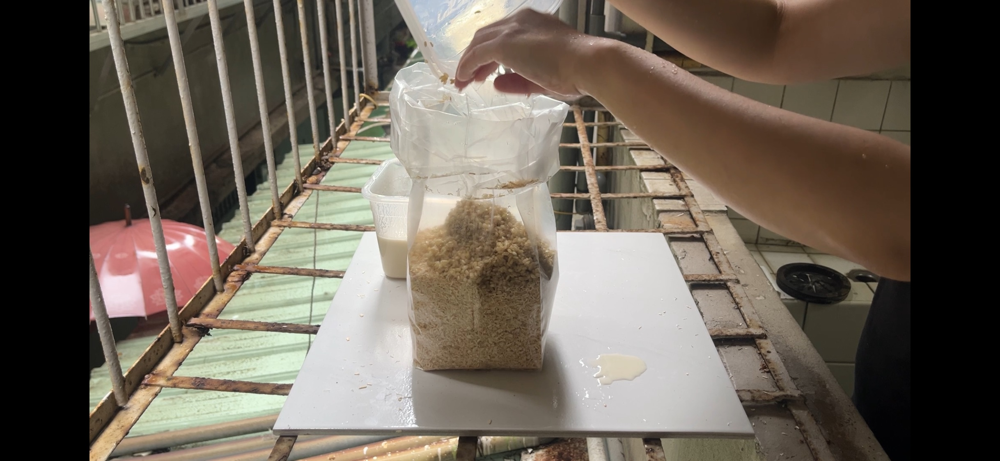

# 2026-07-13

下雨天在 Home Lab 製作新材料包：

[youtu.be/Vub1Qy-vIOo](https://youtu.be/Vub1Qy-vIOo)

[youtu.be/wQ6o0lMmRas](https://youtu.be/wQ6o0lMmRas)

- 配方／製程：木屑、麵粉、米、絲瓜絡
- 問題與觀察：消毒時長原本需要 3 小時。最後 1 小時電磁爐自動關閉了，也許水不夠。
- 下一步：20260714 檢查鍋內的水是否已全用完。
- 資金：self-founded
- tags: 培養基
