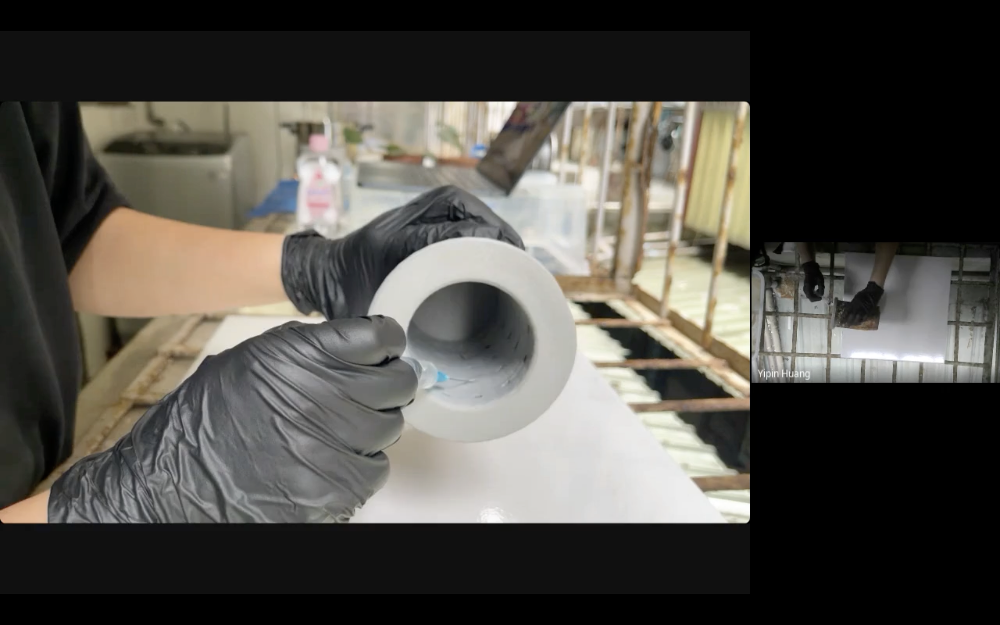
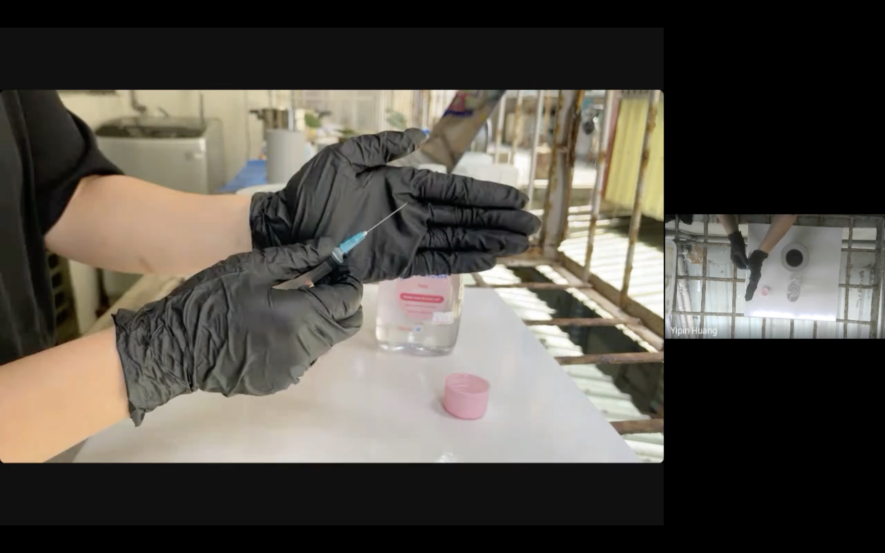

# 2026-07-15

試用嬰兒油能否將真菌複合材和 PLA 模具脫開。

[youtu.be/DFGPTr5C0qU](https://youtu.be/DFGPTr5C0qU)

[youtu.be/DFGPTr5C0qU](https://youtu.be/DFGPTr5C0qU)

[youtu.be/ylRY6WP-Mhc](https://youtu.be/ylRY6WP-Mhc)

- 配方／製程：de-molding mycelium composite used baby massage oil.
- 問題與觀察：每次注入 2ml 太少了。後來用 200 ml 倒進去中間的空洞，使更多嬰兒油浸入真菌材料中。
- 下一步：20260716 傍晚試拆模具
- 贊助：self-founded
