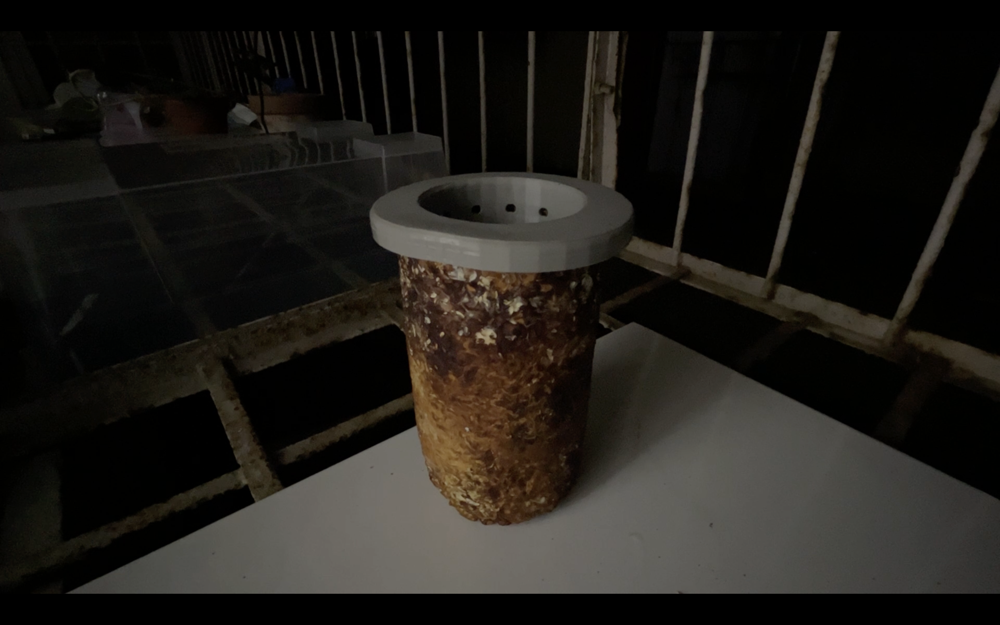

[youtu.be/kloXijNx00M](https://youtu.be/kloXijNx00M)

中文

I am sorry，今天環境比較暗，因為陽台的燈壞掉了。這是昨天用 baby massage oil 處理過的那個樣本。顯然還是拿不出來，後來我還敲擊它。

- 配方／製程：de-molding mycelium composite used baby massage oil.
- 問題與觀察：沒想法。大受打擊。
- 下一步：可能把它切開吧。還有做新的模具
- 贊助：self-founded
- tags: Baby massage oil Track

English

I am sorry, the lighting is quite dim today because the balcony light is broken. This is the sample treated with baby massage oil yesterday. It clearly still would not come out, and later I even tried tapping it.

- Recipe／process：de-molding mycelium composite used baby massage oil.
- Problems／observations：No idea. Quite discouraged.
- Next step：Maybe cut it open. Also make a new mold.
- Funding：self-founded
- tags: Baby massage oil Track

日本語

すみません、今日はベランダの照明が壊れているので環境が少し暗いです。これは昨日 baby massage oil で処理したサンプルです。明らかにまだ取り出せず、後で叩いてもみました。

- 配合／工程：baby massage oil を使って菌糸体複合材料の脱型を試した。
- 問題／観察：考えが浮かばない。かなり落ち込んだ。
- 次のステップ：切り開くかもしれない。新しい型も作る。
- 資金：self-founded
- tags: Baby massage oil Track
